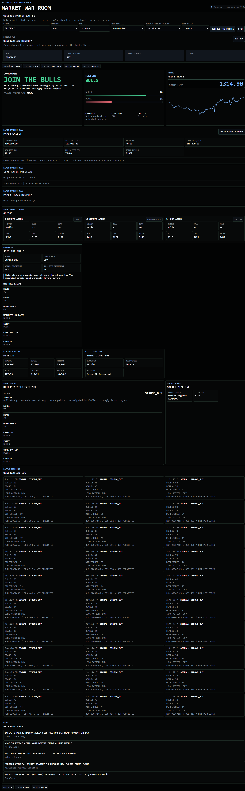

# MARKET WAR ROOM

MARKET WAR ROOM is a standalone static command-center interface for a deterministic bull-vs-bear market signal. It is not a trading platform, does not place orders, and has no broker integration.

## Product Philosophy

The user is a spectator with limited capital. The browser observes multiple timeframe battlefields, renders local market intelligence, and calculates the authoritative bull-vs-bear signal locally.

## Project Structure

```text
market-war-room/
├── index.html
├── styles.css
├── app.js
├── config.js
├── favicon.svg
├── README.md
└── js/
```

The app uses HTML5, CSS3, vanilla JavaScript, Browser Fetch API, responsive SVG, and SessionStorage. There is no React, Vue, Angular, npm requirement, bundler, or chart library.

## Endpoints

Configured in `config.js`:

```js
window.APP_CONFIG = {
  MARKET_URL:
    "https://jmyqvrvrguhfujgombqe.supabase.co/functions/v1/market"
};
```

No secrets belong in frontend files.

## Market Engine

The frontend calls `/market` for the selected timeframe arenas and keeps partial success visible. One failed arena does not hide successful arenas.

The browser calculates local market intelligence, including:

- SMA, EMA, RSI, ATR, returns, relative volume
- recent highs and lows
- candle freshness
- bull and bear evidence
- arena winner and momentum
- campaign dominance
- deterministic BUY / WAIT / SELL signal

## Deterministic Signal Engine

The local bull-vs-bear engine is the only authority for Commander direction.

```text
difference = bullStrength - bearStrength
```

Exact thresholds:

```text
difference >= +20     STRONG_BUY
difference +8 to +19  BUY
difference -7 to +7   WAIT
difference -19 to -8  SELL
difference <= -20     STRONG_SELL
```

For `SELL` and `STRONG_SELL`, this long-only application displays:

```text
LONG ACTION: DO NOT BUY
```

It does not imply short selling or automatic order execution.

Signal confidence is calculated locally from the bull-bear difference and arena alignment. It is labeled `SIGNAL CONFIDENCE`, never probability of profit.

Raw candles are used for the chart and local indicators. No compact evidence is sent to a strategy or analysis service.

## Market Direction Analyzer

The frontend includes a deterministic Market Direction Analyzer. It calculates a local technical direction from OHLCV candles and explains the indicator read in plain English. It does not call an AI or LLM API.

Use:

```js
import { analyzeMarket } from "./js/analysis/market-analyzer.js";

const result = analyzeMarket(candles, {
  includeCurrentCandle: true
});
```

The analyzer accepts OHLCV candles with:

```ts
{
  timestamp: number;
  open: number;
  high: number;
  low: number;
  close: number;
  volume: number;
}
```

Incoming candles are sorted by timestamp, duplicate timestamps are collapsed, invalid numbers are removed, and NaN values are not allowed into the result. The analyzer returns `INSUFFICIENT_DATA` instead of forcing a direction when fewer than 60 valid candles are available. At least 100 candles are preferred when the feed provides them.

The score is:

```text
VWAP + EMA + RSI + MACD + Market Structure + Volume
```

Market Structure has the highest weight:

```text
Higher High + Higher Low => +2
Lower High + Lower Low   => -2
Mixed / unknown          =>  0
```

Other directional indicators contribute -1, 0, or +1. ADX and ATR are shown as context only. ADX classifies trend strength and ATR reports volatility; neither adds bull or bear points.

Direction thresholds are centralized in:

```text
js/analysis/scoring/direction-score.js
```

The UI shows the calculated indicator direction, score, signal confidence, candle count, candle mode, and a simple indicator breakdown.

## Related Stock Confirmation

The main symbol is no longer reviewed in isolation. The form accepts at least three related symbols:

```text
ONGC,BPCL,IOC
```

For each related symbol, the frontend fetches the same entry timeframe used for the main symbol and runs the same local `analyzeMarket()` calculation. The related-stock result does not blindly override the main symbol direction, but the main confidence depends on this confirmation check:

- most related stocks in the same direction => direction confirmed
- some related stocks in the same direction => partly confirmed, confidence capped below high
- most related stocks in the opposite direction => conflicting, confidence reduced to low
- related stocks mixed or neutral => mixed context, high confidence is capped

This keeps the analysis from depending on only one stock while still making the main symbol's own candles the primary evidence.

## Running Man Persistence

Running Man stores a timestamped sequence of local observations so the system can later replay how market evidence evolved.

The browser creates one stable `runId` for an active observation session and increments a zero-based `observationNo` for each local observation.

The first observation in a run is `0`, then `1`, `2`, `3`, and so on. A live polling loop keeps the same `runId`; it does not create a new UUID for every poll. The `New Run` control starts a fresh run without automatically triggering market analysis.

Running Man client state is stored in SessionStorage under:

```text
market-war-room:running-man
```

The stored client state includes `runId`, the next `observationNo`, whether the run is active, the last persistence summary, and the started timestamp. A new browser session may create a new run.

The local observation timeline stores compact metadata only: observed time, shortened run ID, observation number, signal, bull strength, and bear strength.

## Commander Mapping

Commander uses only the deterministic market signal.

Signal mapping:

- `STRONG_BUY` -> `JOIN THE BULLS`
- `BUY` -> `BULLS HAVE THE EDGE`
- `WAIT` -> `NO CLEAR WINNER`
- `SELL` -> `STAY AWAY FROM LONGS`
- `STRONG_SELL` -> `BEARS CONTROL THE FIELD`

## Loading Behavior

The battlefield renders after the market engine completes:

```text
EAGLE VIEW READY
```

## SessionStorage

The app stores:

```text
market-war-room:last-request
market-war-room:last-response
```

## Safety Notice

Local estimates are not historical probabilities or guarantees. Market data may be delayed or incomplete. No order is placed by this application.

## Local Development

From inside `market-war-room`:

```bash
python -m http.server 8080
```

Open:

```text
http://localhost:8080
```

Alternative:

```bash
npx serve .
```

## Static Deployment

GitHub Pages: publish the `market-war-room` folder or copy its contents to the Pages root.

Netlify: no build command; publish directory is `market-war-room` or `.` when deploying from inside the folder.

Vercel static hosting: leave build command empty and set output directory to `market-war-room` or deploy from inside the folder.

Cloudflare Pages: leave build command empty and set output directory to `market-war-room`.
